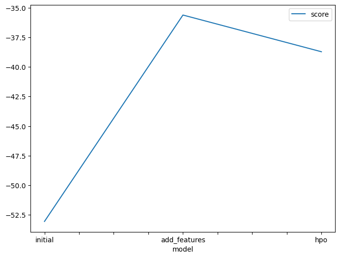
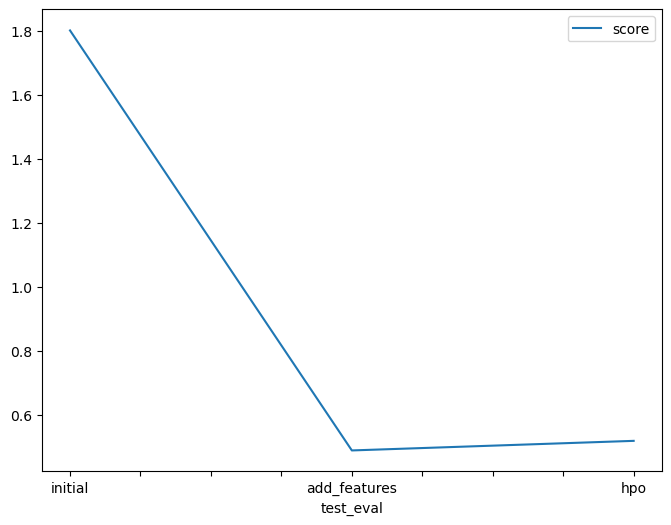

# Report: Predict Bike Sharing Demand with AutoGluon Solution
#### Orhun Kupeli

## Initial Training
### What did you realize when you tried to submit your predictions? What changes were needed to the output of the predictor to submit your results?
Kaggle expects non-negative values for "counts" label. Therefore, I had to zero out all negative values.

### What was the top ranked model that performed?
The best model is WeightedEnsemble_L3 with a RMSE of -35.618306.

## Exploratory data analysis and feature creation
### What did the exploratory analysis find and how did you add additional features?
In order to make data more numerical, I divided datetime feature into day, hour, month and year columns. Besides, I set 
season and weather features data types to category.

### How much better did your model preform after adding additional features and why do you think that is?
Overall performance has been increased dramatically from RMSE -53.050143 to RMSE -35.618306. The main reason is, the complex temporal information became accessible and learnable for Tabular.

## Hyper parameter tuning
### How much better did your model preform after trying different hyper parameters?
Model performance decreased from RMSE -35.618306 to -38.718382. Apparently, presets='best_quality' offers the most optimal configuration.

### If you were given more time with this dataset, where do you think you would spend more time?
I would spend more time on data.

### Create a table with the models you ran, the hyperparameters modified, and the kaggle score.
|model| num_bag_folds | num_bag_sets | num_trials |score|
|--|---------------|--------------|------------|-|
|initial| 8             | 1            | 100        |1.80021|
|add_features| 8             | 1            | 100        |0.48786|
|hpo| 9             | 2            | 95         |0.51781|

### Create a line plot showing the top model score for the three (or more) training runs during the project.

### Create a line plot showing the top kaggle score for the three (or more) prediction submissions during the project.

## Summary

AutoGluon provides valuable insight regarding the best-performing models which makes it a great point to start with.